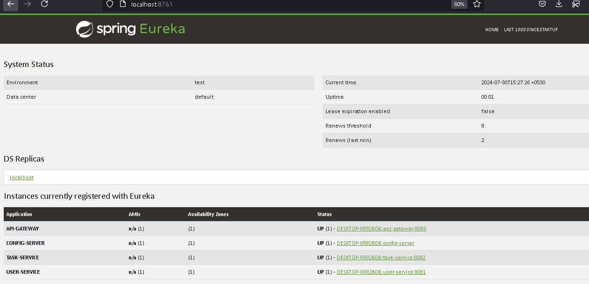

# ToDo Application

## Overview

- The ToDo application represents a streamlined version of a task management system, meticulously designed with a
  `microservices architecture` for optimal efficiency and scalability.
- At its core, the application comprises two pivotal microservices: `user-service` and `task-service`. Each service
  seamlessly integrates with `Eureka` for dynamic registration and discovery, ensuring robust and flexible service
  management.
- Both microservices utilize `PostgreSQL` databases, each housed within its own `Docker` container to ensure isolation
  and consistency. Furthermore, these services can be encapsulated into `Docker images` and effortlessly deployed to a
  variety of container registries, including `Amazon Elastic Container Registry`, `Google Artifact Registry`,
  or `Docker Hub`.
- For developers and integrators, the project features a comprehensive API collection generated via `Insomnia`,
  providing valuable insights into the API functionalities. Additionally, detailed API documentation is available on
  `Swagger`, offering a user-friendly interface for executing and testing the backend services.

## Functional Requirements

- Users can register using their email addresses.
- Users can create, update, and delete tasks.
- User profiles can feature avatars or image URLs.
- Tasks must have a title and a valid status to be created.
- Each task includes a title, description, and status (e.g., "To Do," "In Progress," "Done").
- Users can view, filter, sort, and search through their tasks.
- Tasks support due dates and reminders.
- Proper error handling is implemented, with clear error messages and status codes.

## Non-functional Requirements

- The application must provide a smooth and responsive user experience.
- It should be fully responsive, functioning seamlessly on both desktop and mobile devices.
- Essential components, such as API endpoints and data validation, must be tested thoroughly.
- Basic security measures should be in place to safeguard against common vulnerabilities.

## Technologies

- Programming language- `Java`
- Build- `Maven`
- Framework- `Spring Boot`
- Database- `PostgreSQL`
- Unit Testing- `Junit and Mockito`
- Integration Testing- `testcontainers`
- Containerization- `Docker`
- REST Client- `Open Feign`
- Service Registry- `Spring Cloud Netflix Eureka`
- Distributed Tracing- `Zipkin`
- Configuration Management- `Spring Cloud Config`
- API Gateway- `Spring Cloud Gateway`
- Fault Tolerance and Resilience- `Resilience4J`
- Architecture
    - Microservices architecture

## Setup Instructions

- **Prerequisites**
    - Ensure that both `JDK` and `Docker` are installed on your machine.
- **Process**
    - Clone the repository from GitHub and navigate to the root directory in your terminal.
    - Run `docker compose up` in the terminal to launch the following services: `PostgreSQL`, `pgAdmin4` and `zipkin`.
    - Access the `pgAdmin` console by visiting http://localhost:5050 in your browser and add a new database server:
        - Choose a name for the server and enter the connection details.
        - Once the server is configured, create two databases: `users` and `tasks`.
    - Start the microservices by either running them from `IntelliJ` or executing the main files in each `Spring Boot`
      service in the following order:
        - `ServiceRegistryApplication`
        - `ConfigServerApplication`
        - `UserServiceApplication`
        - `TaskServiceApplication`
        - `ApiGatewayApplication`
    - Access `http://localhost:8083/eureka/main` to verify if all the required clients/services have been registered in
      `Eureka Server`.

## Illustrative Images

