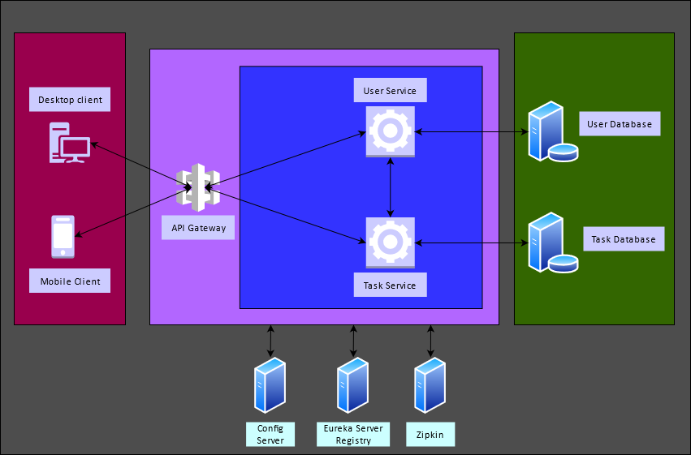

# ToDo Application

## Overview

- ToDo application is a basic version of a task management application.
- The application is built using microservices architecture.
- It has two microservices supporting smooth functionality of the application, `user-service` and `task-service`.
- Both the services use PostgreSQL as their respective database hosted in a docker container.
- The services can also be packaged as docker images and pushed to a container registry of choice (e.g. Amazon Elastic
  Container Registry, Google Artifact Registry, Docker Hub).
- The project also includes an API collection generated via Insomnia to better understand the functionality of the APIs.
  APIs have been documented in Swagger as well for the folks who just want to execute and test the backend APIs.

## Functional Requirements

- Users should be able to register themselves by providing an email id.
- Users should be able to create, update, and delete tasks.
- User profiles should have avatars or image URLs.
- Include validation to ensure that tasks cannot be created without a title and valid status.
- Tasks should have a title, description, and a status (e.g., "To Do," "In Progress," "Done")
- Users should also be able to view a list of tasks and filter them by status.
- Implement task sorting and searching capabilities.
- Implement task due dates and reminders.
- Errors should be handled properly, including sending appropriate error messages and status codes.

## Non-functional Requirements

- User interactions should be smooth and responsive.
- Ensure that the application is responsive and works well on both desktop and mobile devices.
- Critical parts of your application, such as API endpoints and data validation, should be supported by tests.
- Basic security measures should be implemented to protect the application from common vulnerabilities.

## Technologies

- Programming language- `Java`
- Build- `Maven`
- Framework- `Spring Boot`
- Database- `PostgreSQL`
- Unit testing- `Junit and Mockito`
- Integration testing- `testcontainers`
- Containerization- `Docker`
- Architecture
    - Microservices architecture

## Setup Instructions

- **Prerequisites**
    - Have `JDK` & `Docker` installed in the machine.
- **Process**
    - Checkout the repository from Github and navigate to the root directory in the terminal.
    - From the terminal, execute `docker compose up` which will start two services, postgres and pgadmin4.
    - Navigate to pgadmin console in the browser using the address http://localhost:5050 and add a database server.
        - Choose the name as per your wish and enter the connection properties.
        - Once the server is set up, create two databases `users` and `tasks`.
        - Start both the services either by running them as services in IntelliJ or running the main files in each
          service.

          
          

## Additional Supporting Images

